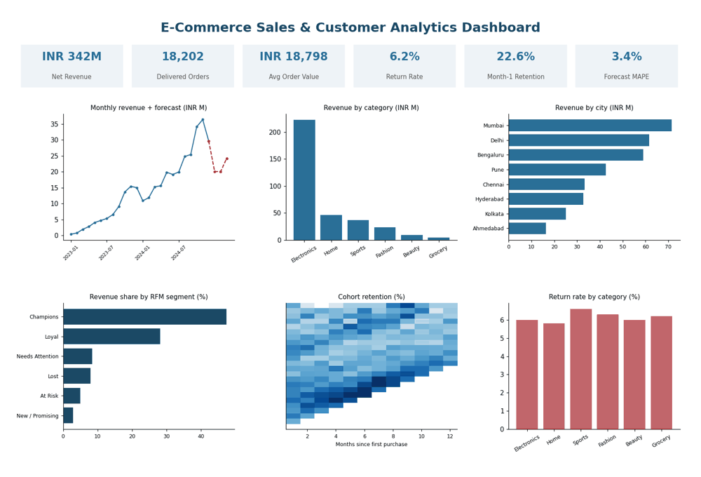
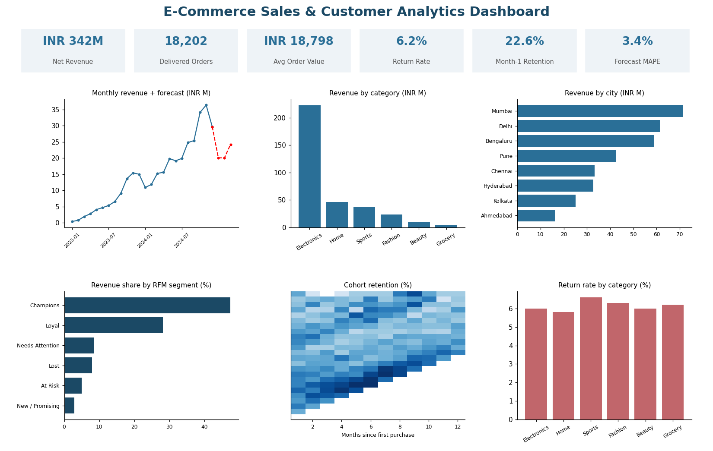

# E-Commerce Sales & Customer Analytics

   

End-to-end analytics pipeline: messy raw data -> cleaning/ETL -> SQL star schema -> KPIs -> RFM segmentation -> cohort retention -> forecast -> business recommendations -> PDF report.

**Full explanation + 32 interview Q&A: [Project_Guide.pdf](Project_Guide.pdf)**



## Dashboard


## Key results
| Metric | Result |
|---|---|
| Net revenue (delivered orders) | INR 342M from 18,202 orders |
| Average order value | INR 18,798 |
| Return / cancellation rate | 6.2% / 4.0% |
| Revenue concentration | Electronics = 65% of revenue; Mumbai is the top city |
| Customer value | Champions: 27% of customers, 47% of revenue |
| Retention | ~23% of customers buy again in month 1 |
| Forecast | Backtest error (MAPE) 3.4% on last 3 months |

## Business questions answered
1. Where does revenue come from (category, city, season)?
2. Who are the best and at-risk customers? (RFM)
3. Do customers come back? (cohort retention)
4. What should we expect next quarter? (forecast)
5. What should the business do? (win-back, reduce returns, diversify)

## Tech stack
Python (pandas, numpy, matplotlib) - SQL (SQLite, joins, CASE, window functions) - ReportLab (PDF) - Git

## Run it (about 1 minute)
```
pip install -r requirements.txt
python run_all.py
```
This regenerates the data, warehouse, tables, charts, dashboard, `docs/04_insights.md` and `Project_Guide.pdf`.

## Project structure
```
ecommerce-analytics/
  run_all.py             one-command pipeline
  Project_Guide.pdf      full guide + interview Q&A
  sql/queries.sql        all named SQL queries
  src/                   generate_data, etl, kpi, rfm, cohort, forecast, report, dashboard, build_pdf, utils
  data/raw, data/processed   input CSVs, SQLite warehouse
  reports/figures, tables    charts, result CSVs, metrics + data-quality logs
  docs/                  overview, data dictionary, methodology, insights, interview Q&A
```

## Author
Sahil Shivgan - [LinkedIn](https://www.linkedin.com/in/sahil-shivgan-engineer25/) - [GitHub](https://github.com/Sahilshivgan)
